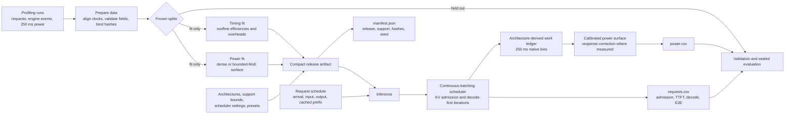

# PowerTrace-Sim model pipeline

This is the paper-facing end-to-end flow for the selected PowerTrace model.
The maintained model predicts request timing and node GPU power; it does not
learn an unconstrained sequence generator.

## Training path

`prepare_data` validates the canonical timing dataset, request/run index,
frozen split manifests, probe calibration, and power-ledger cache. It records a
SHA-256 identity for every input instead of copying large arrays into the
release. This creates the only accepted input to `train`.

The timing branch fits effective compute bandwidth, effective memory
bandwidth, launch/message overhead, sampling overhead, and first-token
overhead against measured request timings. The equations and feature set are
frozen; refitting changes coefficients only. Holdout model/hardware groups are
excluded before fit points are constructed.

The power branch uses the same simulated 250 ms work ledger as inference. For
dense transformers it fits nonnegative coefficients over idle power, active
weight fraction, compute utilization, and duty-weighted memory utilization.
For supported MoE models it fits the declared model-specific surface using
lagged memory, exact active compute, engine-iteration rate, and decode batch.
The hardware meter delay and averaging response are explicit transformations,
not learned hidden state.

Both branches are assembled with architecture records, routing assumptions,
deployment presets, calibrated support, and provenance into one
`powertrace-release-v1` JSON artifact. The checked-in artifact remains
`pre_sealed` until every supported held-out run passes the preregistered timing,
energy, autocorrelation, and NRMSE gates.

## Inference path

At inference, categorical output lengths are realized first; this is the only
operation controlled by `--seed`. The scheduler then models KV admission,
chunked prefill, continuous batching, and decode-first iteration timing. Each
iteration is projected onto the native 250 ms ledger, and the selected dense or
MoE surface maps the ledger to deterministic GPU power. TP output is reported
as both mean per-GPU power and TP-summed node GPU power; it does not fabricate
different traces for individual GPUs.

## Evaluation and leakage boundary

Validation consumes the same three-file inference result used by downstream
facility studies. Primary power metrics are total energy error, signed bias,
range-normalized RMSE, 1 s ACF-MAE, and 1 s ACF R2. End-to-end timing is scored
from the request table. Normalized Soft-DTW is report-only. Sealed data may be
scored once after the artifact is frozen and must never feed coefficient,
feature, threshold, or support decisions.

The archived GMM-BiGRU pipeline is scientifically separate. It remains
runnable under `archive/gmm_bigru_v1/`, but it neither trains nor serves the
selected release.
